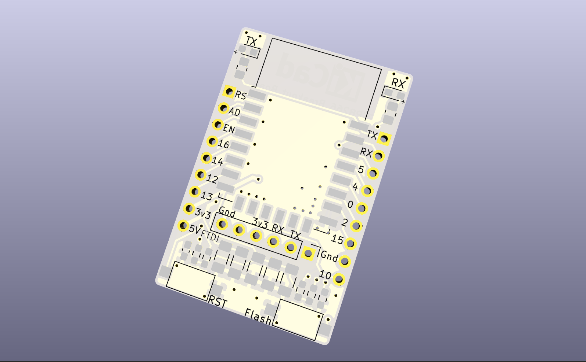
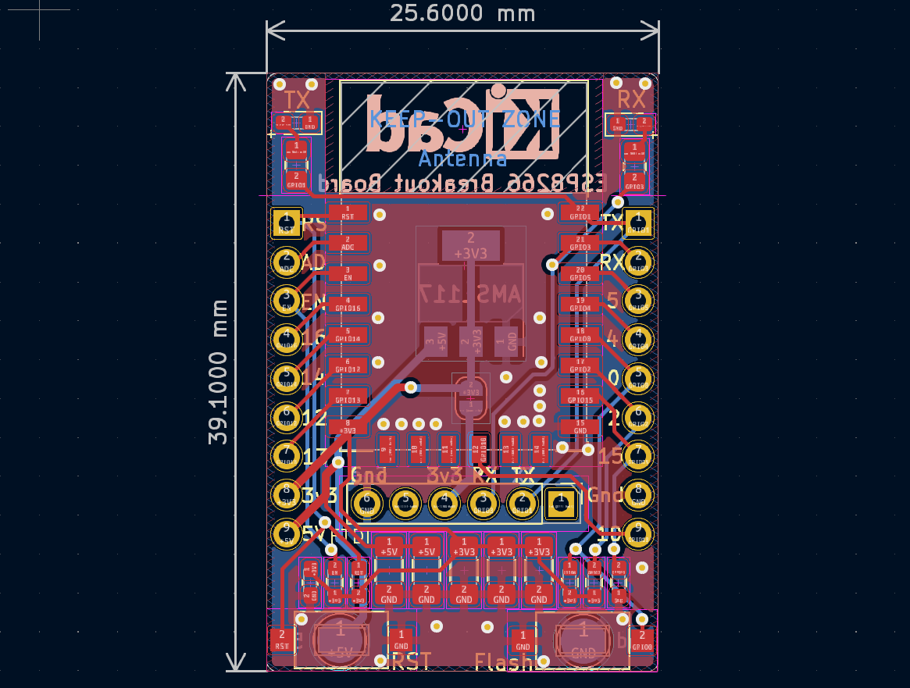

# ESP8266-breakout
A breadboard friendly ESP12E/F breakout with all I/O pins available, flash/reset buttons onboard, and pins ready to use with FTDI module

## License
This project is licensed under the CERN-OHL-S-2.0 (applies from the very first commit on Mar 7, 2021) with the added condition that it may not be used for commercial purposes without prior permission from the license holder.